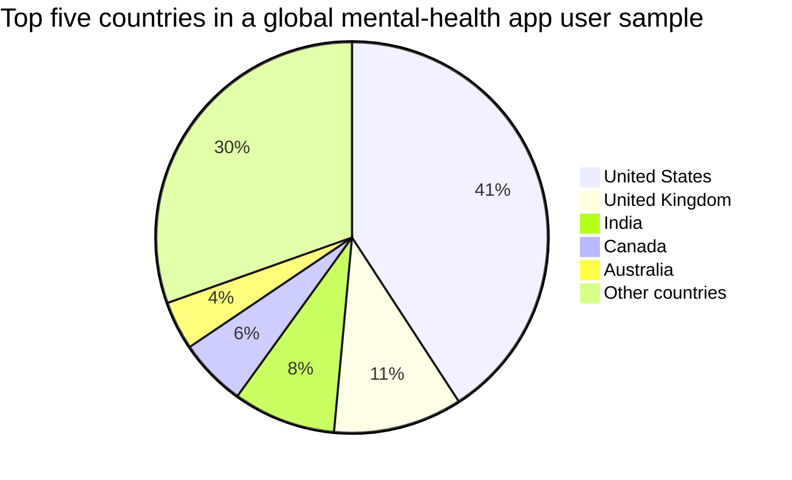

# Room to Respond

Room to Respond is a research prototype for therapists and life coaches to create personalised mental workout routines for clients. Clients practise between sessions by examining moments from their lives, trying guided scenarios, using text and voice, and sharing reviewable reflections with their coach.

We can understand Room to Respond through a parallel with physical activity. Modern life reduced some of the physical activity built into daily life. Cars replaced some walking. Elevators replaced some climbing. Machines reduced some manual work. This contributed to physical inactivity. ([WHO Global status report on physical activity](https://www.who.int/publications/i/item/9789240059153)).

The challenges arising out of physical inactivity have led us to dedicated workout routines. For example, physical gyms provide physical workouts for physical muscles. They bring different exercises together in a practical routine. What if we had a gym for the mind? Room to Respond is such a gym.

## A Gym for the mind!

Modern life also changes how people use their minds:

- social media, notifications, and smartphones compete for attention. Experimental research has found measurable attention costs from smartphone presence ([study](https://pmc.ncbi.nlm.nih.gov/articles/PMC10249922/));
- digital environments shape how people experience, express, and regulate emotion. Research finds a relationship between emotion dysregulation and problematic smartphone use, with meaningful variation across studies ([systematic review and meta-analysis](https://pubmed.ncbi.nlm.nih.gov/36497921/));
- search, recommendation systems, and generative AI make it easier to offload remembering, comparing, drafting, and deciding. Research on cognitive offloading shows that external tools change the demands placed on memory and metacognition ([review](https://pmc.ncbi.nlm.nih.gov/articles/PMC9971128/));
- faster communication and more complex work create more frequent social and practical judgments.

We’ve attempted to address many of these challenges through therapy. However, mental health also has a development side to it. People can work with therapists and life coaches to strengthen the mental faculties: attention, emotion awareness, self-regulation, perspective, motivation, judgment, communication, flexibility, foresight, and learning. With GenAI shifting skill development toward subtler skills such as judgment, taste, self-awareness, communication, emotional regulation, and sense-making, my hypothesis is that people will increasingly place more emphasis on active development of mental faculties. More details can be found in [From mental healthcare to mental fitness](docs/MENTAL_FITNESS_CATEGORY_THESIS.md).

## Target Audience

Room to Respond is for therapists, life coaches, and clients who already use technology for mental health, wellbeing, coaching, journaling, meditation, habits, learning, or personal development. The coach is the buyer and routine creator. The client is the person who practises between sessions and shares a reflection. Digital mental-health, therapy, coaching, and wellbeing companies are potential distribution partners.

The audience is global.

| Market | Definition | Current global signal |
| --- | --- | ---: |
| **TAM** | People who seek mental-health services | **1B+ people with mental-health needs** |
| **SAM** | People who use technology-based mental-health solutions beyond virtual consultation | **23.3% app use among people with a current mental-health disorder** |



The [Target audience and market](docs/TARGET_AUDIENCE.md) document contains the source labels and market snapshot.

## What are the mental faculties and how do we organise them?

We can group mental faculties by the role that they play in any situation:

- **Notice** — attention, perception, emotion awareness, and bodily signals. Executive-function research describes attention, inhibition, and cognitive control as core capacities for selecting what matters and pausing before responding ([Diamond](https://doi.org/10.1146/annurev-psych-113011-143750)). Emotion-regulation research adds the importance of identifying emotional responses and the point at which a person can influence them ([Gross](https://doi.org/10.1080/1047840X.2014.940781)).
- **Understand** — memory, meaning-making, metacognition, assumptions, and perspective. Autobiographical-memory research describes how people connect experiences with identity and life narratives ([Fivush](https://doi.org/10.1080/00207594.2011.596541)); metacognition helps people examine how they reached a conclusion.
- **Choose** — values, motivation, judgment, decisions, and self-regulation. Self-determination research connects autonomy, competence, and relatedness with motivation and wellbeing ([Deci, Olafsen, and Ryan](https://doi.org/10.1146/annurev-orgpsych-032516-113108)). Decision research shows that structured reflection can improve the discovery of far-sighted strategies ([Becker et al.](https://doi.org/10.1017/jdm.2023.16)).
- **Adapt** — cognitive flexibility, imagination, foresight, feedback, and learning. Executive-function research identifies flexibility as a core capacity, while prospection research connects imagining possible futures with planning and action ([Diamond](https://doi.org/10.1146/annurev-psych-113011-143750); [Szpunar](https://pmc.ncbi.nlm.nih.gov/articles/PMC4074678/)).

A single workout can move across all four groups, from noticing what is happening to choosing a response and learning from it. Room to Respond brings the relevant exercises together into one practical routine for a client to develop their mental faculties.

## Prototype: one coach-led mental workout

A coach assigns the first routine. The client thinks of a moment from their life and describes what happened, what they felt, thought, said, did, wanted, and noticed afterward.

The system then:

1. reflects back a few tentative observations for the client to keep, revise, or reject;
2. changes one condition in the situation, such as the amount of time or support available;
3. asks the client to respond to the changed situation;
4. compares the two responses and asks what could be useful in real life;
5. creates a reflection that the client can edit and share with the coach.

The coach reviews what changed, what stayed open, and what the client wants to explore. This informs the next routine.

The workout exercises emotion awareness, metacognition, cognitive flexibility, prospection, and learning. Memory, values, social cognition, and meaning-making may also appear in the account. This first routine is a research prototype; evaluation will examine which outcomes the prompts affect and how exercises for a wider range of faculties can be combined into efficient mental workout routines.

For longer accounts, the input text box can be configured to analyse one event, several events within one situation, or several situations across time.

## Role of Gen AI

GenAI marks an inflection point because it can build a workout around the client's own situation and adapt the next exercise to the client's words, context, and previous practice. It can:

- ask questions about a specific situation;
- follow the person's own words and context;
- hold a thread across multiple exercises;
- offer alternative interpretations;
- change one condition in a situation;
- rehearse a conversation or response;
- explore possible consequences;
- support text and future voice interactions;
- help compare what changed over time.

The client supplies the experience, reviews the reflection, and decides what to carry forward. The coach sets the direction and reviews the reflection.

## Privacy: the guardrail and the roadblock

Privacy is central because the product works with intimate situations, emotional responses, personal patterns, and changes across time. A hosted product sends that material through an application operator and a model provider. Users may reasonably question who can retain it, access it, use it to improve systems, or connect it with their identity.

On-device inference opens the path to privacy-first personal AI products. Personal memory and reasoning can stay on the user's device. The launch standard includes local encryption, deletion, recovery, sharing, and device security alongside capable reasoning.

The go-to-market trigger is therefore a hypothesis: launch the privacy-first version when on-device models can provide the reasoning quality needed for the workouts and the full privacy system has been validated.

Until that point, Room to Respond needs to have the following in place:

- validated workouts and outcome measures;
- therapist, coach, and client review of model behaviour and safety boundaries;
- a user-controlled model of experiences, faculties, changes, and uncertainty;
- text and voice interaction designs;
- local storage, deletion, encryption, selective sharing, and recovery flows;
- a portable model layer that can move from hosted to on-device inference;
- distribution relationships with therapists, digital-therapy companies, and mental-health organisations.

Today's prototype uses hosted inference when configured. It prepares the interaction, research foundation, and portable model layer for a future on-device product.

## Boundaries

Room to Respond is a reflection and exploration product. Therapy, diagnosis, crisis support, risk assessment, treatment recommendations, and care decisions belong with qualified professionals and services. Constructed situations are exercises for observation and reflection. The system operates on the user's words and context and does not infer clinical states from text, voice, pauses, accent, or emotional tone.

## Documentation

- [Product truth](docs/PRODUCT_TRUTH.md)
- [Experience specification](docs/EXPERIENCE_SPEC.md)
- [Design source of truth](docs/DESIGN_SOURCE_OF_TRUTH.md)
- [Acceptance review](docs/ACCEPTANCE_REVIEW.md)
- [Mental workout model](docs/MENTAL_WORKOUT_MODEL.md)

- [Human Faculties Map](docs/HUMAN_FACULTIES_MAP.md)
- [Product storyboard](docs/PRODUCT_STORYBOARD.md)
- [Guided demo journey](docs/GUIDED_DEMO_JOURNEY.md)
- [Guided demo storyboard v2](docs/GUIDED_DEMO_STORYBOARD_V2.md)
- [Landing-page copy direction](docs/LANDING_PAGE_COPY_DIRECTION.md)
- [Narrative model selection](docs/NARRATIVE_MODEL_SELECTION.md)
- [Prototype role lenses](docs/PROTOTYPE_ROLE_LENSES.md)
- [UX writing review](docs/UX_WRITING_REVIEW.md)
- [Product thesis](docs/PRODUCT_THESIS.md)
- [Target audience](docs/TARGET_AUDIENCE.md)
- [Self-model research basis](docs/SELF_MODEL_RESEARCH.md)
- [Modern life and mental faculties](docs/MODERN_LIFE_AND_MENTAL_FACULTIES.md)
- [Professional journey model](docs/PROFESSIONAL_JOURNEY_MODEL.md)
- [Agent model](docs/AGENT_MODEL.md)
- [Frontend journey](docs/FRONTEND_JOURNEY.md)
- [Lived-to-constructed journey](docs/SCENARIO_JOURNEY.md)
- [Privacy and safety](docs/PRIVACY_AND_SAFETY.md)
- [Evaluation plan](docs/EVALUATION_PLAN.md)
- [Therapist review packet](docs/THERAPIST_REVIEW_PACKET.md)
- [Product name review](docs/PRODUCT_NAME_REVIEW.md)
- [Product naming research](docs/NAME_RESEARCH.md)
- [Architecture](docs/ARCHITECTURE.md)
- [Reusable review playbook](docs/REUSABLE_REVIEW_PLAYBOOK.md)

## Run locally

```bash
npm install
npm run dev
```

The app works with a fixture fallback by default. To enable the hosted model route, copy `.env.example` to `.env`, add `OPENAI_API_KEY`, and restart the dev server. The key is read only by `api/reflect.ts`.

```bash
npm run build
```

The public repository contains no private autobiographical material, private conversations, or API credentials.
