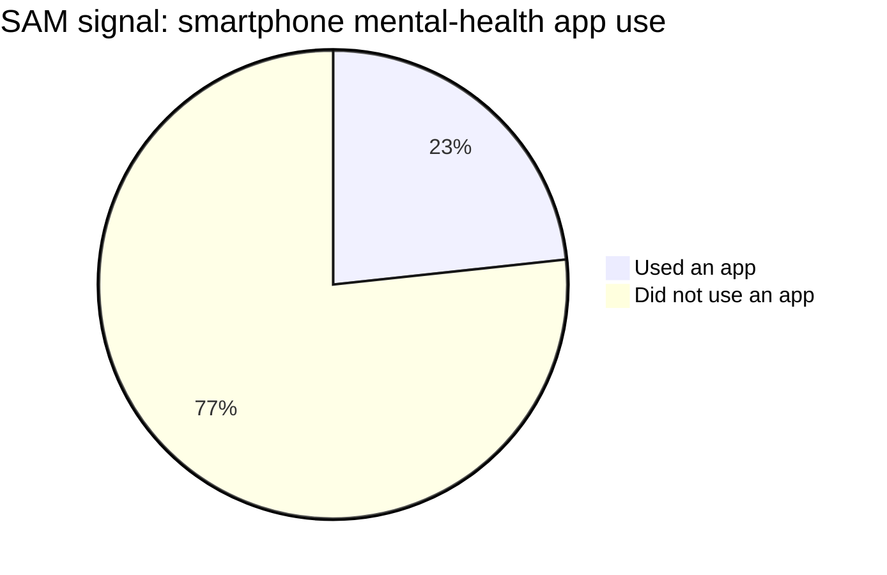
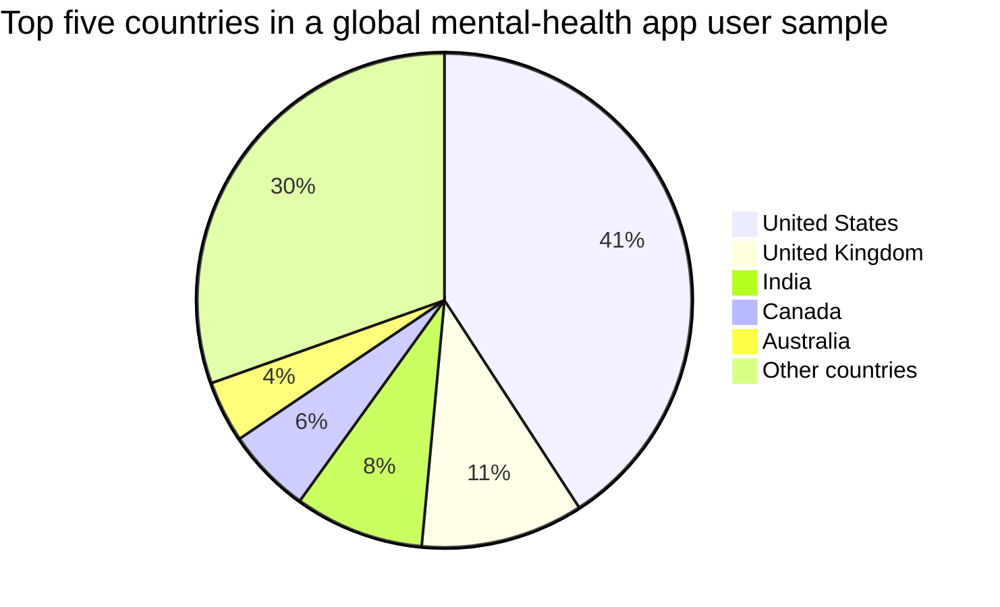

# Target audience and market

## Target audience

Room to Respond is for therapists, life coaches, and clients who already use technology for mental health, wellbeing, coaching, journaling, meditation, habits, learning, or personal development.

The coach is the buyer and workout creator. The client exercises between sessions and shares reflections and outcomes with the coach. Digital mental-health, therapy, coaching, and wellbeing companies are potential distribution partners.

## Market snapshot

| Market | Definition | Current global signal |
| --- | --- | ---: |
| **TAM** | People who seek mental-health services | **1B+ people with mental-health needs** |
| **SAM** | People who use technology-based mental-health solutions beyond virtual consultation | **23.3% app use among people with a current mental-health disorder** |

The TAM figure represents the global population with mental-health needs who may seek support. The WHO reports that more than one billion people live with a mental-health condition. Service use remains far below need, so this is a market-need proxy rather than a count of completed consultations.

The SAM signal comes from a systematic review and meta-analysis of smartphone use for mental-health disorders. Across the included studies, 23.29% of people with a current mental-health disorder used a smartphone application for their condition.

## Geographic contribution

The strongest published country-level signal comes from a global study of MoodTools, a self-guided mental-health app. The study covered **158,930 users across 198 countries** between March 2016 and February 2018.

| Country contribution in the MoodTools study | Share |
| --- | ---: |
| United States | 40.83% |
| United Kingdom | 10.64% |
| India | 8.47% |
| Canada | 5.60% |
| Australia | 4.02% |
| Other countries | 30.44% |

This is a directional view of where digital mental-health demand can be reached.

### Sources

- [WHO Mental Health Atlas 2024](https://www.who.int/teams/mental-health-and-substance-use/data-research/mental-health-atlas)
- [WHO: Over a billion people living with mental-health conditions](https://www.who.int/news/item/02-09-2025-over-a-billion-people-living-with-mental-health-conditions-services-require-urgent-scale-up)
- [Smartphone application use patterns for mental-health disorders: systematic review and meta-analysis](https://doi.org/10.1016/j.ijmedinf.2023.105092)
- [Global user behaviour of the MoodTools mental-health app](https://pmc.ncbi.nlm.nih.gov/articles/PMC9644247/)
